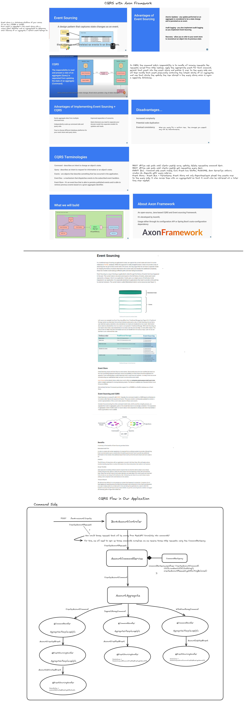

### How to run
- First, you need Docker installed in your system.
- After you installed Docker, you can easily run the Axon Server by the following command ;
  docker run -d --name axonserver -p 8024:8024 -p 8124:8124 axoniq/axonserver
- Then, you can clone the project, and run it.

### Technologies
- Java 17
- Spring Boot 3.2.4
- Spring Data JPA
- H2 In-memory Database
- Axon Framework
- Maven Build Tool
- Docker
  
